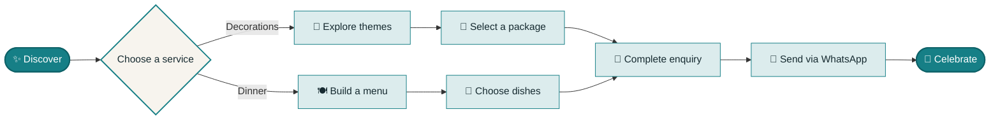
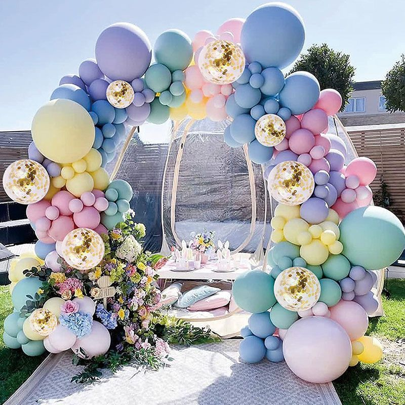
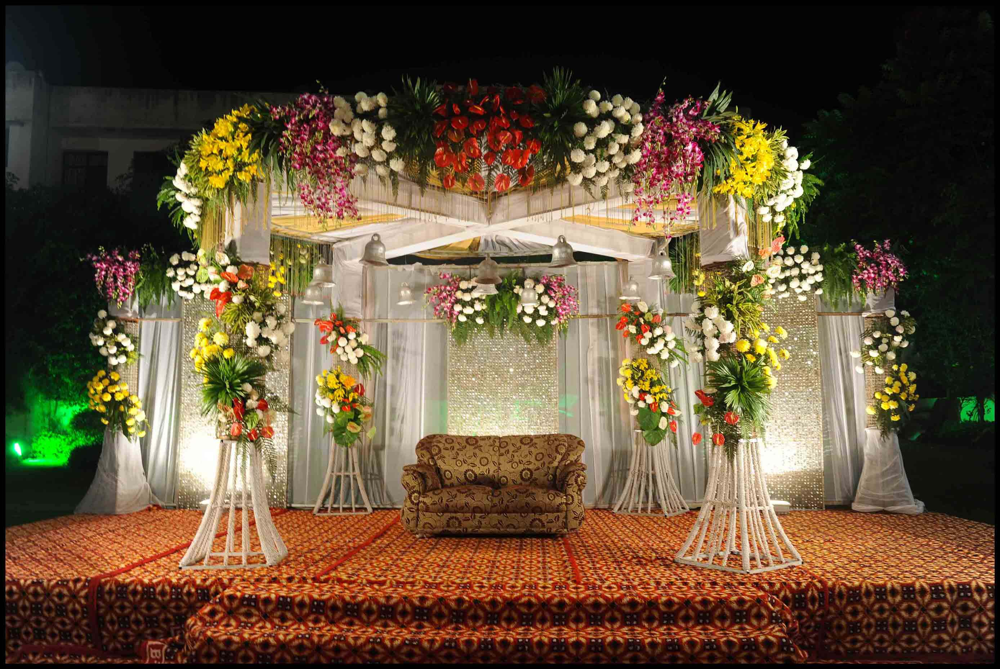
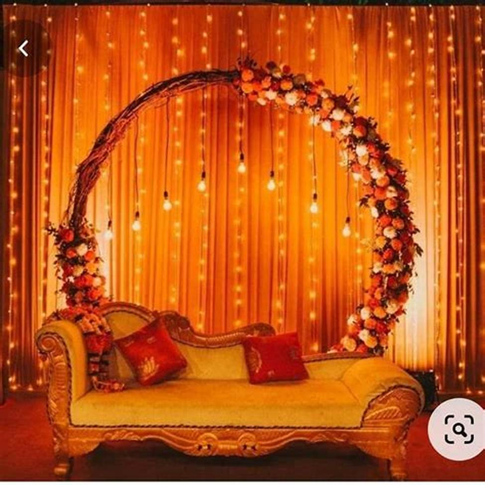
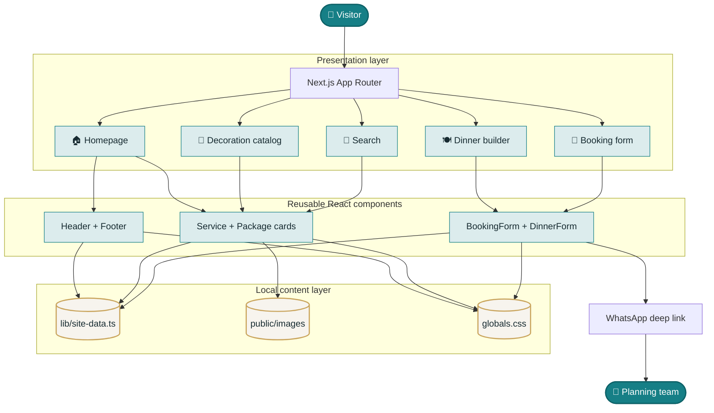

<div align="center">
  <h1>🎊 Occasion Hub 🎊</h1>

  <p><strong>Beautiful celebrations, thoughtfully planned.</strong></p>
  <p>
    Explore curated décor, create a custom dinner menu, and send your complete
    event enquiry directly through WhatsApp.
  </p>

  <p>
    <code>Next.js 16</code>&nbsp;
    <code>React 19</code>&nbsp;
    <code>TypeScript</code>&nbsp;
    <code>Responsive</code>&nbsp;
    <code>Local Images</code>
  </p>
</div>

---

## 🌟 The experience at a glance



> Browse → personalize → enquire → celebrate. No account or complicated checkout required.

## ✨ What makes Occasion Hub special?

Occasion Hub brings the important parts of event planning into one friendly experience. Visitors can discover a theme, compare transparent starting prices, personalize a menu, and contact the planning team without creating an account.

| Experience | What it offers |
| --- | --- |
| 🎈 Curated decorations | Six styled packages for every supported occasion |
| 🍽️ Custom dinner menus | Flexible main dish, snack, and sweet selections |
| 💬 WhatsApp enquiries | Pre-filled booking and menu messages sent directly to the team |
| 🔎 Helpful search | Fast navigation to decoration and dinner pages |
| 📱 Responsive design | A polished experience across phones, tablets, and desktops |
| 🖼️ Local media | All 42 image assets are served locally through `next/image` |

## 🎉 Celebrations for every story

<table>
  <tr>
    <td align="center"><br /><strong>Birthdays</strong></td>
    <td align="center"><br /><strong>Weddings</strong></td>
    <td align="center"><br /><strong>Engagements</strong></td>
  </tr>
</table>

The catalog also includes anniversary celebrations and other private parties, each with dedicated décor and dinner-planning experiences.

## 🚀 Getting started

### Requirements

- Node.js `20.9.0` or newer
- npm `10` or newer

### Install and run

```bash
git clone https://github.com/alishaaverma/OccasionHub_website.git
cd OccasionHub_website
npm install
npm run dev
```

Open [http://localhost:3000](http://localhost:3000) in your browser.

### Production build

```bash
npm run build
npm run start
```

## 🧭 Main routes

| Route | Purpose |
| --- | --- |
| `/` | Homepage and service introduction |
| `/decurationpage` | Decoration occasion directory |
| `/dinnerpage` | Dinner-plan directory |
| `/birthday` | Birthday decoration collection |
| `/wedding` | Wedding decoration collection |
| `/anniversary` | Anniversary decoration collection |
| `/engagement` | Engagement decoration collection |
| `/otherparty` | Other-party decoration collection |
| `/[occasion]dinner` | Custom dinner-menu builder |
| `/form` | WhatsApp booking enquiry form |
| `/search?q=...` | Service-page search results |

The original URL spelling `/decurationpage` is intentionally preserved for compatibility with existing links.

## 🛠️ Technology

| Layer | Tools |
| --- | --- |
| Framework | Next.js 16 App Router |
| Interface | React 19 |
| Language | TypeScript |
| Styling | Responsive global CSS |
| Images | `next/image` with files from `public/images` |
| Enquiries | WhatsApp deep links generated in the browser |
| Quality | ESLint and strict TypeScript checking |

## 🏗️ Application architecture



### How information moves

1. The App Router resolves the requested page through the shared dynamic route.
2. Reusable components read occasion, package, price, and menu configuration from `lib/site-data.ts`.
3. `next/image` serves optimized visuals from the local `public/images` directory.
4. Client-side forms validate selections and compose a WhatsApp message.
5. WhatsApp opens the enquiry directly with the planning team—no customer data is stored by the website.

## 🗂️ Project structure

```text
OccasionHub/
├── app/
│   ├── [slug]/page.tsx      # Occasion, dinner, form, and search routes
│   ├── globals.css          # Complete responsive design system
│   ├── layout.tsx           # Shared metadata, navigation, and footer
│   └── page.tsx             # Homepage
├── components/
│   ├── BookingForm.tsx      # Event enquiry form
│   ├── DecorCatalog.tsx     # Decoration package grid
│   ├── DinnerForm.tsx       # Custom menu builder
│   └── ...                  # Shared interface components
├── lib/
│   └── site-data.ts         # Occasions, prices, routes, and contact settings
├── public/
│   └── images/              # All locally stored visual assets
├── next.config.ts
├── package.json
└── tsconfig.json
```

## 🎨 Customizing the website

Most content is centralized in [`lib/site-data.ts`](./lib/site-data.ts). Update that file to:

- add or rename an occasion;
- change decoration packages and prices;
- adjust dinner-menu field counts;
- update searchable routes;
- change the WhatsApp contact number.

Add new images to [`public/images`](./public/images), then reference them with a path such as `/images/your-image.jpg`.

## ✅ Quality checks

Run these before sharing or deploying changes:

```bash
npm run lint
npm exec tsc -- --noEmit
npm run build
```

---

<div align="center">
  <p><strong>Plan less. Celebrate more. 🥂</strong></p>
</div>
